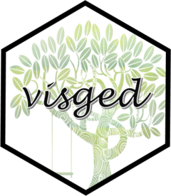

<!-- README.md is generated from README.Rmd. Please edit that file -->

```{r, include = FALSE}
knitr::opts_chunk$set(
  collapse = TRUE,
  comment = "#>",
  fig.path = "man/figures/README-",
  out.width = "100%"
)
```

# visged 

<!-- badges: start -->
<!-- badges: end -->

Produce a variety of visualisations for family tree GEDCOM files. Coming (not so) soon!

The package is part of the `gedcompendium` ecosystem of packages. This ecosystem enables the handling of `tidyged` objects (tibble representations of GEDCOM files), and the main package of this ecosystem is [`tidyged`](https://jl5000.github.io/tidyged/).


```{r, echo=FALSE, out.width="65%", fig.align='center'}
knitr::include_graphics("man/figures/allhex.png")
```

## Installation

You can install the development version from [GitHub](https://github.com/) with:

``` r
# install.packages("devtools")
devtools::install_github("jl5000/visged")
```


