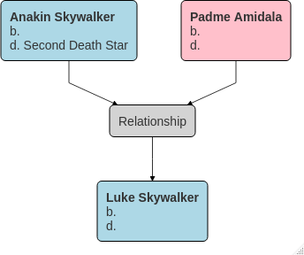
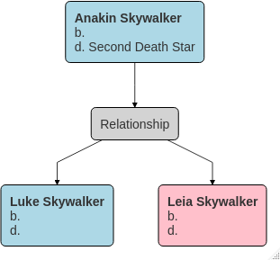

<!-- README.md is generated from README.Rmd. Please edit that file -->

# visged 

<!-- badges: start -->

[](https://github.com/jl5000/visged/actions)
[](https://codecov.io/gh/jl5000/visged)
[](https://www.codefactor.io/repository/github/jl5000/visged)
[](https://www.tidyverse.org/lifecycle/#experimental)
<!-- badges: end -->

Produce a variety of visualisations for family tree GEDCOM files.

The package is part of the `gedcompendium` ecosystem of packages. This
ecosystem enables the handling of `tidyged` objects (tibble
representations of GEDCOM files), and the main package of this ecosystem
is [`tidyged`](https://jl5000.github.io/tidyged/).


## Installation

You can install the development version from
[GitHub](https://github.com/) with:

``` r
# install.packages("remotes")
remotes::install_github("jl5000/visged")
```

## Example

``` r
library(tidyged)
library(visged)
#> Loading required package: tidyged.io
#> When importing existing GEDCOM files, you should ensure that they are error free.
#> This package assumes imported GEDCOM files are valid and very few validation checks are carried out.
#> Several GEDCOM validators are available, including an online validator at http://ged-inline.elasticbeanstalk.com/

sw <- gedcom() %>%
  add_indi(sex = "M", indi_notes = "The central character in the Star Wars Skywalker Saga") %>%
  add_indi_names(name_pieces(given = "Anakin", surname = "Skywalker"), type = "birth") %>%
  add_indi_names(name_pieces(prefix = "Darth", given = "Vader"), type = "given") %>%
  add_indi(sex = "F", indi_notes = "Queen of Naboo") %>%
  add_indi_names(name_pieces(given = "Padme", surname = "Amidala"), type = "birth") %>% 
  add_indi(sex = "F") %>% 
  add_indi_names(name_pieces(given = "Leia", surname = "Skywalker"), type = "birth") %>%
  add_indi_names(name_pieces(prefix = "Princess", given = "Leia", surname = "Organa"), type = "adoptive") %>% 
  add_indi(sex = "M") %>%
  add_indi_names(name_pieces(given = "Luke", surname = "Skywalker"), type = "birth") %>% 
  add_indi(sex = "M") %>% 
  add_indi_names(name_pieces(given = "Obi-Wan", nickname = "Ben", surname = "Kenobi"), type = "birth") %>% 
  add_famg(husband = find_indi_name(., "Anakin"), 
           wife = find_indi_name(., "Padme"), 
           children = c(find_indi_name(. ,"Luke"), find_indi_name(., "Leia"))) %>%
  activate_indi(find_indi_name(., "Anakin")) %>% 
  add_indi_fact("death", age = "45y", cause = "Killed by son Luke",
                fact_place = place("Second Death Star", notes = "Orbiting Endor System"))
```

``` r
pedigree_chart(sw, find_indi_name(sw, "Luke"))
```



``` r
descendancy_chart(sw, find_indi_name(sw, "Anakin"))
```


